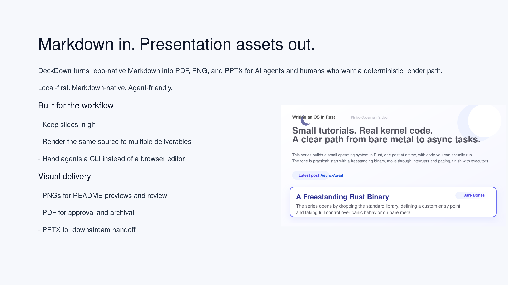
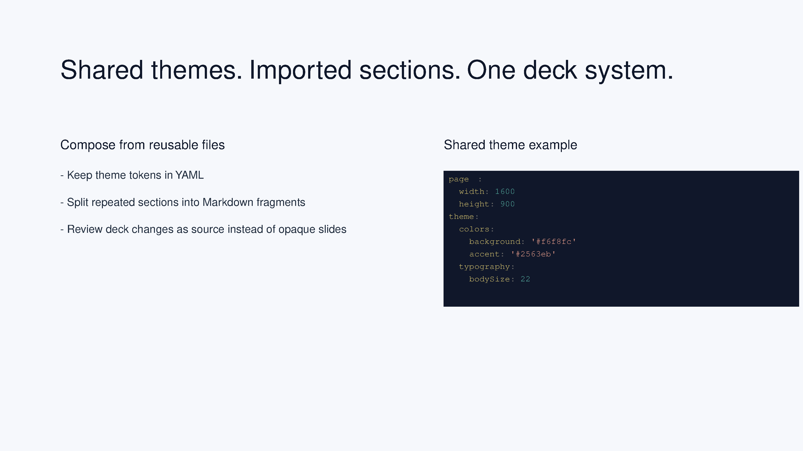
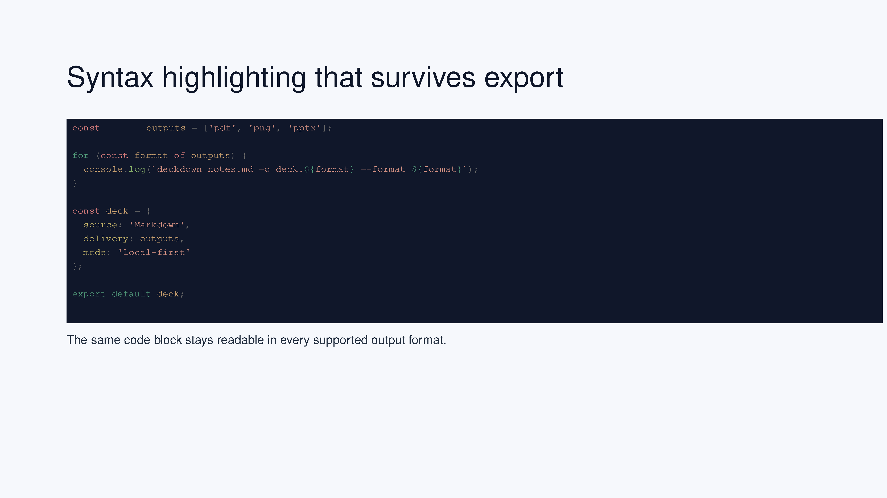
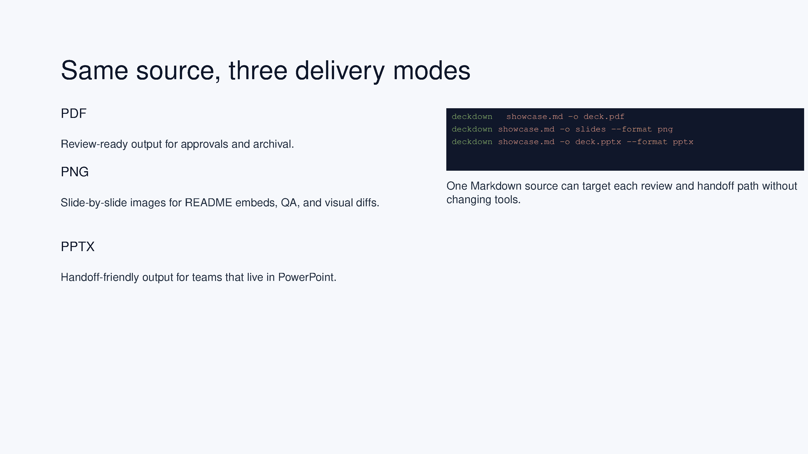

# DeckDown

> Markdown presentation engine for AI agents with local PDF, PNG, and PPTX output.

DeckDown is a local-first Markdown-to-presentation compiler for repo-native slide workflows. Write decks in Markdown, compose shared sections with imports, theme them with YAML, and render the same source to review-ready assets or handoff-ready PowerPoint files.

DeckDown is not an AI presentation generator. It is the render engine agents and humans can drive reliably.

## Install

```bash
npm install -g deckdown@latest
```

One-off use without a global install:

```bash
npx deckdown@latest --help
```

Published package:
- npm: `https://www.npmjs.com/package/deckdown`

## Showcase

<p align="center">
  
</p>

<p align="center"><em>Image-led hero slide from Markdown source.</em></p>

<p align="center">
  
  
</p>

<p align="center"><em>Reusable theme and import workflow on the left, Shiki-powered code rendering on the right.</em></p>

<p align="center">
  
</p>

<p align="center"><em>One Markdown deck can target PDF, PNG, and PPTX without changing tools.</em></p>

Showcase source:
- [`samples/readme-showcase.md`](./samples/readme-showcase.md)
- [`samples/readme-showcase-imports.md`](./samples/readme-showcase-imports.md)

Rendered with:

```bash
deckdown samples/readme-showcase.md -o docs/assets/showcase --format png
```

## Documentation

| Guide | Use it for |
| --- | --- |
| [Docs Overview](./docs/index.md) | start here and navigate the rest of the docs |
| [Getting Started](./docs/getting-started.md) | install DeckDown and render your first deck |
| [CLI Reference](./docs/cli.md) | learn the command shape, output behavior, and flags |
| [Authoring Guide](./docs/authoring.md) | use frontmatter, imports, images, and layout attributes |
| [AI Agent Workflows](./docs/agent-workflows.md) | fit DeckDown into agent-driven content pipelines |

## Quick Start

Create `deck.md`:

```markdown
---
title: Product Review
theme:
  colors:
    background: '#ffffff'
    text: '#111827'
    heading: '#0f172a'
    accent: '#2563eb'
    codeBg: '#f8fafc'
---

# Product Review

DeckDown compiles Markdown slides to real presentation files.

---

# Shared Source, Multiple Outputs

- PDF for review
- PNG for previews and visual QA
- PPTX for downstream handoff
```

Render it:

```bash
deckdown deck.md -o deck.pdf
deckdown deck.md -o slides --format png
deckdown deck.md -o deck.pptx --format pptx
```

## Why DeckDown

- Repo-native authoring: keep decks in git, review changes as text, and split shared material into reusable Markdown or YAML files.
- Deterministic rendering: the same source deck can produce PDF, PNG, and PPTX locally without a browser editing step.
- AI-agent friendly: agents can generate the Markdown, run one CLI command, and hand off real presentation files.
- Small authoring surface: frontmatter, imports, and layout attributes cover the common cases without turning Markdown into a hidden slide editor.

## Output Formats

| Format | Output | Notes |
| --- | --- | --- |
| PDF | single file or stdout | best for review, export, and archival |
| PNG | directory of slide images | requires Ghostscript and works well for docs, previews, and QA |
| PPTX | single file | best for PowerPoint handoff |

## Requirements

| Task | Requirement |
| --- | --- |
| Run DeckDown | Node.js `>= 18` |
| Generate PNG | Ghostscript (`gs`) on `PATH` |
| Run `npm run release-check` | `gs`, `pdftoppm`, and LibreOffice `soffice` |

Current limits:
- images are expected to be local files
- `--watch` is not implemented

## Example Decks

- [`samples/readme-showcase.md`](./samples/readme-showcase.md) for the homepage gallery deck
- [`samples/sample-deck.md`](./samples/sample-deck.md) for a compact end-to-end example
- [`samples/phil-opp-os/presentation.md`](./samples/phil-opp-os/presentation.md) for a larger imported deck

## Release Verification

Before publishing, run:

```bash
npm run release-check
```

The release gate verifies test suites, sample renders, packed CLI behavior, and npm packaging.

## Development

```bash
npm install
npm test
npm pack --pack-destination dist
```

## License

[MIT](./LICENSE)
