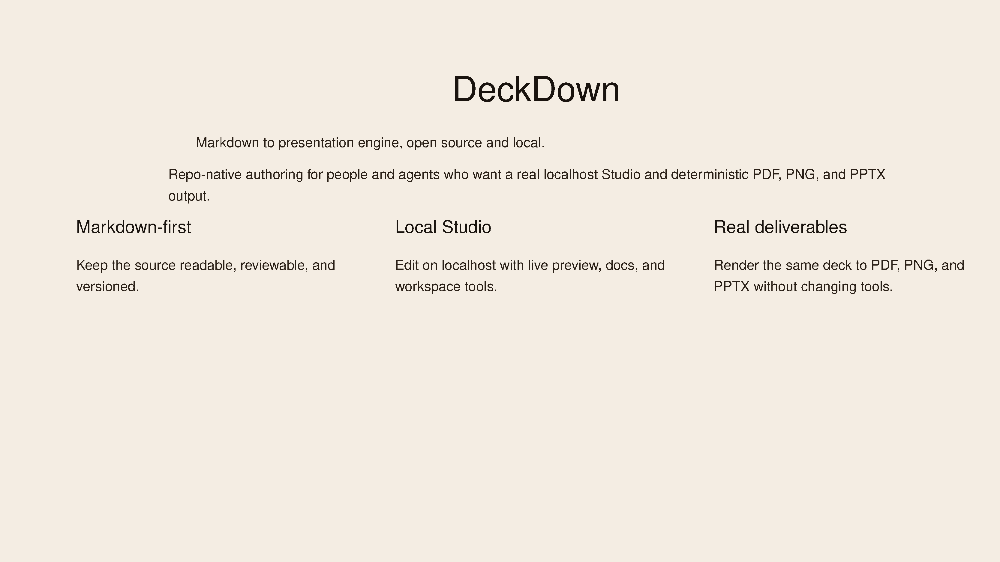
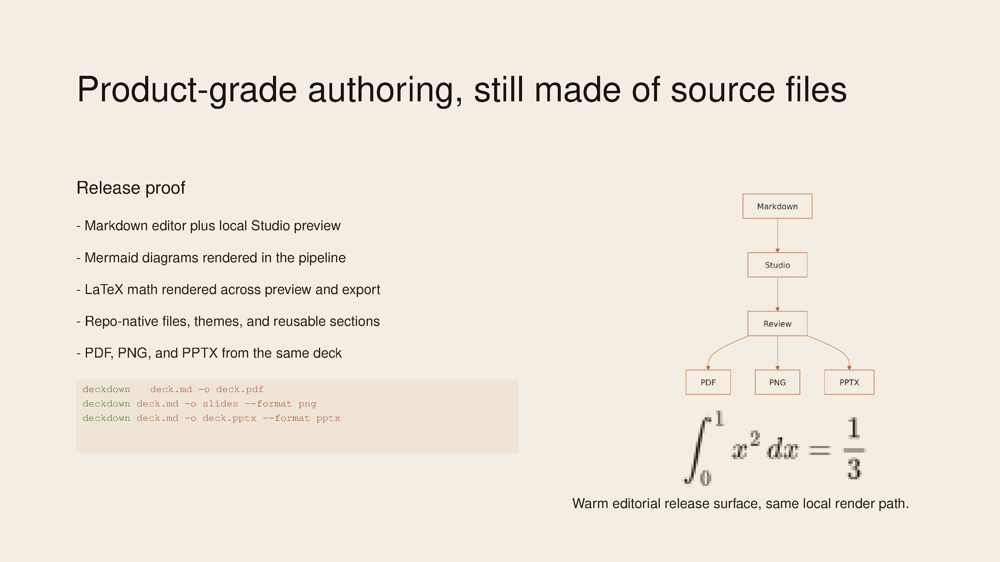
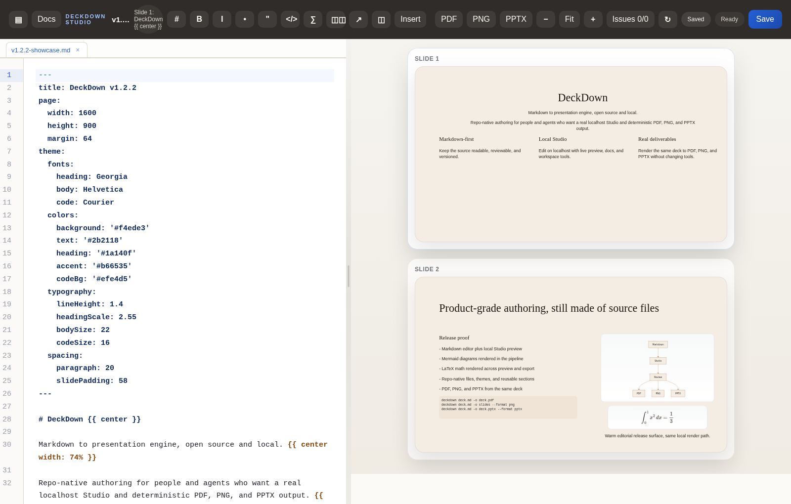
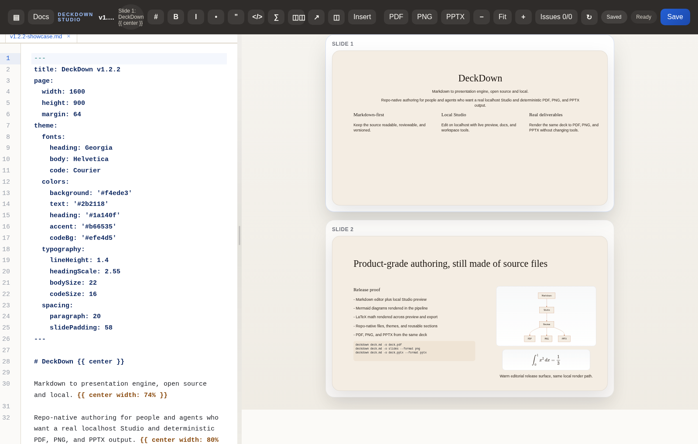
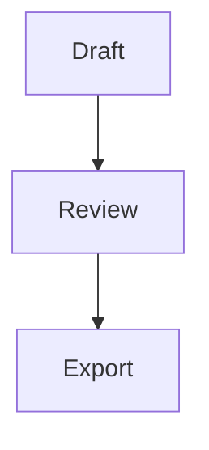

# DeckDown

> Markdown to presentation engine, open source and local.

DeckDown is a local-first, open source Markdown-to-presentation engine for teams that want readable source files, a real localhost Studio, and deterministic output to PDF, PNG, and PPTX.

It is built for repo-native slide workflows. Write in Markdown, keep themes and shared sections in source control, review changes as text, and render the same deck into review assets or handoff files without switching tools.

## Install

```bash
npm install -g deckdown@latest
```

One-off use without a global install:

```bash
npx deckdown@latest --help
```

Published package:
- npm: `https://www.npmjs.com/package/deckdown`

## Quick Start

Scaffold a workspace:

```bash
deckdown init .
deckdown init . --template paper-letter
```

Open the localhost Studio:

```bash
deckdown studio .
```

Create a first deck:

```markdown
---
title: Product Review
theme:
  colors:
    background: '#ffffff'
    text: '#111827'
    heading: '#0f172a'
    accent: '#2563eb'
    codeBg: '#f8fafc'
---

# Product Review

DeckDown compiles Markdown slides to real presentation files.

---

# Same Source, Multiple Outputs

- PDF for review
- PNG for visual QA
- PPTX for downstream handoff
```

Render it:

```bash
deckdown deck.md -o deck.pdf
deckdown deck.md -o slides --format png
deckdown deck.md -o deck.pptx --format pptx
```

## Why DeckDown

- Repo-native authoring: keep decks in git, split shared content into Markdown or YAML, and review changes as source instead of opaque slide binaries.
- Local Studio: edit and review on localhost with a file tree, live preview, diagnostics, docs, and export controls in one workflow.
- Real render pipeline: Mermaid and LaTeX survive the actual preview and export path instead of stopping at a mock browser view.
- One source, multiple deliverables: generate PDF, PNG, and PPTX from the same Markdown deck.
- Open and inspectable: no hosted editor requirement, no hidden project state, no lock-in around the authoring surface.

## Showcase

<p align="center">
  
</p>

<p align="center"><em>The new v1.2.2 showcase deck opens with a warm-editorial release slide built in real DeckDown source.</em></p>

<p align="center">
  
</p>

<p align="center"><em>The second slide proves product features in the deck itself: Mermaid, LaTeX, repo-native authoring, and multi-format delivery.</em></p>

<p align="center">
  
</p>

<p align="center"><em>Studio stays source-first: deck files on the left, real rendered preview on the right, localhost all the way through.</em></p>

<p align="center">
  
</p>

<p align="center"><em>The same deck drives the README visuals, Studio review flow, and exported release assets.</em></p>

Showcase source:
- [`samples/v1.2.2-showcase.md`](./samples/v1.2.2-showcase.md)
- [`samples/readme-showcase.md`](./samples/readme-showcase.md)

## Studio

DeckDown Studio is a localhost editing and review surface for the same source files you keep in the repository.

Current Studio workflow includes:
- CodeMirror-based Markdown editing
- DeckDown-aware snippets and completions
- inline diagnostics while typing
- file-tree workspace navigation
- active-slide outline
- local docs browser
- asset preview
- keyboard shortcuts and saved layout preferences
- template bootstrap for empty workspaces

Studio is not a separate document model. It operates directly on the repo files.

## Mermaid And LaTeX

DeckDown supports both Mermaid and display-style LaTeX math blocks in the preview and export pipeline.

Mermaid:

````markdown

````

LaTeX:

```markdown
$$
\int_0^1 x^2 \, dx = \frac{1}{3}
$$
```

These blocks render through the same local path used for Studio, PDF, PNG, and PPTX output.

## Output Formats

| Format | Output | Best for |
| --- | --- | --- |
| PDF | single file or stdout | approvals, review, archival |
| PNG | directory of slide images | README embeds, QA, visual diffs |
| PPTX | single file | downstream PowerPoint handoff |

## Documentation

| Guide | Use it for |
| --- | --- |
| [Docs Overview](./docs/index.md) | start here and navigate the docs set |
| [Getting Started](./docs/getting-started.md) | install DeckDown and render your first deck |
| [CLI Reference](./docs/cli.md) | learn commands, flags, and output behavior |
| [Authoring Guide](./docs/authoring.md) | work with frontmatter, imports, images, and layout attributes |
| [AI Agent Workflows](./docs/agent-workflows.md) | fit DeckDown into agent-driven content pipelines |
| [AI Instructions](./docs/ai.md) | reuse canonical `AGENTS.md` guidance |

## Example Decks

- [`samples/v1.2.2-showcase.md`](./samples/v1.2.2-showcase.md) for the current release surface deck
- [`samples/readme-showcase.md`](./samples/readme-showcase.md) for the earlier gallery-style README deck
- [`samples/sample-deck.md`](./samples/sample-deck.md) for a compact end-to-end example
- [`samples/phil-opp-os/presentation.md`](./samples/phil-opp-os/presentation.md) for a larger imported deck

## Requirements

| Task | Requirement |
| --- | --- |
| Run DeckDown | Node.js `>= 18` |
| Generate PNG | Ghostscript (`gs`) on `PATH` |
| Run `npm run release-check` | `gs`, `pdftoppm`, and LibreOffice `soffice` |

Current limits:
- images are expected to be local files
- `--watch` is not implemented

## Release Verification

Before publishing, run:

```bash
npm run release-check
```

The release gate verifies:
- Jest suites
- sample PDF, PNG, and PPTX rendering
- packed CLI behavior
- npm packaging contents

## Development

```bash
npm install
npm test -- --runInBand
npm run release-check
```

## License

[MIT](./LICENSE)
