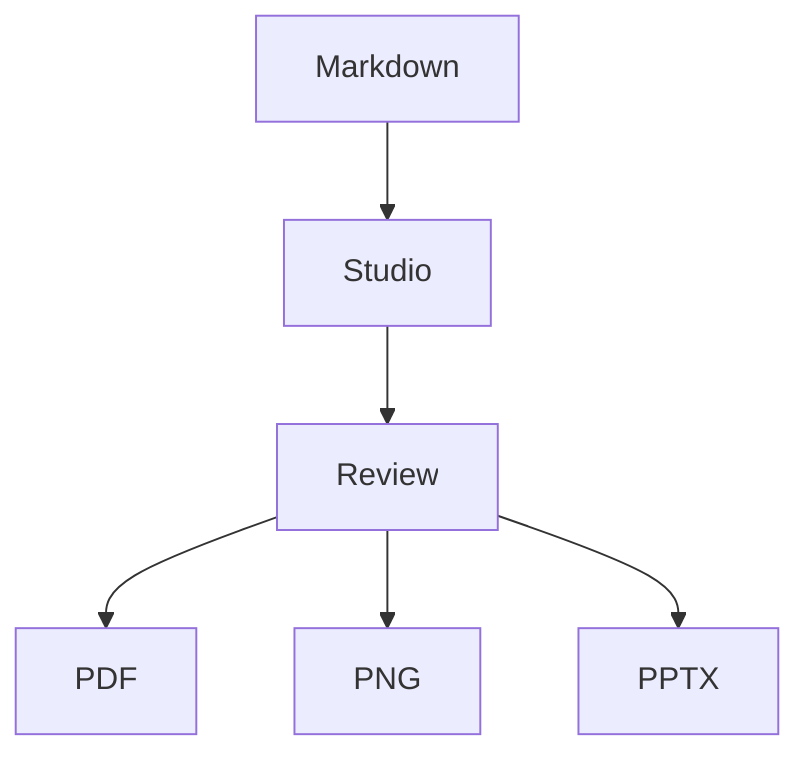

# DeckDown v1.2.2 README Refresh Implementation Plan

> **For agentic workers:** REQUIRED SUB-SKILL: Use superpowers:subagent-driven-development (recommended) or superpowers:executing-plans to implement this plan task-by-task. Steps use checkbox (`- [ ]`) syntax for tracking.

**Goal:** Ship a polished `v1.2.2` release surface with a new README, a new two-slide showcase deck, fresh rendered PNG assets, and fresh localhost Studio screenshots based on the new deck.

**Architecture:** Build the release visuals from real DeckDown source first, render them into stable README assets, then rewrite `README.md` against the final asset paths and capture Studio proof from the same deck. Keep all work repo-native by storing the deck in `samples/` and generated images in `docs/assets/showcase/`.

**Tech Stack:** DeckDown Markdown/YAML authoring, local Studio, PNG export path, Chrome DevTools for screenshots, Jest and `release-check` for verification.

---

### Task 1: Create the new v1.2.2 showcase deck source

**Files:**
- Create: `samples/v1.2.2-showcase.md`
- Modify: `samples/readme-showcase-imports.md` only if a shared fragment clearly reduces duplication
- Reference: `samples/readme-showcase.md`

- [ ] **Step 1: Draft the new two-slide deck source**

Write `samples/v1.2.2-showcase.md` with a warm-editorial theme, two slides only, and the approved tagline.

```markdown
---
title: DeckDown v1.2.2
page:
  width: 1600
  height: 900
  margin: 64
theme:
  fonts:
    heading: Georgia
    body: "Helvetica Neue"
    code: "IBM Plex Mono"
  colors:
    background: "#f4efe6"
    text: "#2a2118"
    heading: "#1d160f"
    accent: "#b45f2f"
    codeBg: "#f8f3eb"
  typography:
    lineHeight: 1.42
    headingScale: 2.45
    bodySize: 22
    codeSize: 16
  spacing:
    paragraph: 20
    slidePadding: 58
---

# DeckDown

Markdown to presentation engine, open source and local.

Warm, repo-native slide authoring for Studio, PDF, PNG, and PPTX.

---

# Product-grade authoring without leaving source control

{{ cols: 2 }}

## What ships in DeckDown

- Local Studio with Markdown-first editing
- Mermaid fences rendered in preview and export
- LaTeX blocks rendered across outputs
- PDF, PNG, and PPTX from the same source
- Repo-native files, themes, and reusable sections

{{ col: break }}



$$
\\int_0^1 x^2 \\, dx = \\frac{1}{3}
$$
```

- [ ] **Step 2: Review the deck source for product-fit**

Run: `sed -n '1,260p' samples/v1.2.2-showcase.md`
Expected: two slides, warm-editorial theme, tagline present, feature slide includes Mermaid and LaTeX blocks.

- [ ] **Step 3: Adjust the deck copy until it reads like release material**

Keep the deck product-led and concise. Use this checklist while editing:

```text
- hero slide feels like a launch asset, not a template
- feature slide names only features that exist today
- copy stays grounded in repo-native/local Studio language
- no generic AI-marketing filler
```

- [ ] **Step 4: Commit the deck source**

```bash
git add samples/v1.2.2-showcase.md
git commit -m "docs: add v1.2.2 showcase deck"
```

### Task 2: Render stable README showcase assets from the new deck

**Files:**
- Create: `docs/assets/showcase/v1.2.2-slide-001.png`
- Create: `docs/assets/showcase/v1.2.2-slide-002.png`
- Source: `samples/v1.2.2-showcase.md`

- [ ] **Step 1: Remove any stale v1.2.2 slide assets**

Run: `rm -f docs/assets/showcase/v1.2.2-slide-001.png docs/assets/showcase/v1.2.2-slide-002.png`
Expected: no output.

- [ ] **Step 2: Render the showcase deck to PNG**

Run: `node src/cli.js samples/v1.2.2-showcase.md -o docs/assets/showcase/v1.2.2-slide --format png`
Expected: DeckDown writes a PNG directory containing slide images for the new deck.

- [ ] **Step 3: Normalize the generated asset names for README references**

Run these exact commands:

```bash
mv docs/assets/showcase/v1.2.2-slide/slide-001.png docs/assets/showcase/v1.2.2-slide-001.png
mv docs/assets/showcase/v1.2.2-slide/slide-002.png docs/assets/showcase/v1.2.2-slide-002.png
rmdir docs/assets/showcase/v1.2.2-slide
```

Expected: two stable PNG files exist directly under `docs/assets/showcase/`.

- [ ] **Step 4: Verify the assets exist**

Run: `ls -l docs/assets/showcase/v1.2.2-slide-001.png docs/assets/showcase/v1.2.2-slide-002.png`
Expected: both files listed with non-zero sizes.

- [ ] **Step 5: Commit the rendered slide assets**

```bash
git add docs/assets/showcase/v1.2.2-slide-001.png docs/assets/showcase/v1.2.2-slide-002.png
git commit -m "docs: render v1.2.2 showcase slide assets"
```

### Task 3: Capture fresh localhost Studio screenshots from the new deck

**Files:**
- Create: `docs/assets/showcase/v1.2.2-studio-editor.png`
- Create: `docs/assets/showcase/v1.2.2-studio-preview.png`
- Source: `samples/v1.2.2-showcase.md`

- [ ] **Step 1: Launch Studio on the new deck**

Run: `node src/cli.js studio samples/v1.2.2-showcase.md --port 4176 --no-open`
Expected: Studio prints `DeckDown Studio running at http://127.0.0.1:4176/`.

- [ ] **Step 2: Open the localhost Studio and frame the editor proof shot**

Use Chrome DevTools on `http://127.0.0.1:4176/` and confirm this visual state before capturing:

```text
- file tree visible
- editor shows the new deck source
- preview shows slide 1 clearly
- top bar / export controls visible
```

- [ ] **Step 3: Capture the editor-forward screenshot**

Save a screenshot as:

```text
docs/assets/showcase/v1.2.2-studio-editor.png
```

Expected: image shows editor, preview, and file tree in one polished Studio frame.

- [ ] **Step 4: Capture a preview-forward screenshot**

Adjust the viewport or scroll so the preview side is more prominent and save:

```text
docs/assets/showcase/v1.2.2-studio-preview.png
```

Expected: image still clearly reads as Studio, but emphasizes the rendered preview experience.

- [ ] **Step 5: Verify the screenshot assets exist**

Run: `ls -l docs/assets/showcase/v1.2.2-studio-editor.png docs/assets/showcase/v1.2.2-studio-preview.png`
Expected: both files listed with non-zero sizes.

- [ ] **Step 6: Stop the localhost Studio process**

Send `Ctrl+C` to the running Studio session.
Expected: process exits cleanly and the port is released.

- [ ] **Step 7: Commit the Studio screenshots**

```bash
git add docs/assets/showcase/v1.2.2-studio-editor.png docs/assets/showcase/v1.2.2-studio-preview.png
git commit -m "docs: add v1.2.2 studio screenshots"
```

### Task 4: Rewrite README.md around the new release assets

**Files:**
- Modify: `README.md`
- Reference: `docs/assets/showcase/v1.2.2-slide-001.png`
- Reference: `docs/assets/showcase/v1.2.2-slide-002.png`
- Reference: `docs/assets/showcase/v1.2.2-studio-editor.png`
- Reference: `docs/assets/showcase/v1.2.2-studio-preview.png`
- Optional create: `docs/releases/v1.2.2.md`

- [ ] **Step 1: Replace README structure with the new product arc**

Rewrite `README.md` so the top half follows this structure:

```markdown
# DeckDown

> Markdown to presentation engine, open source and local.

## Install

## Quick Start

## Why DeckDown

## Showcase
```

Expected: install and quickstart remain near the top, before the long narrative sections.

- [ ] **Step 2: Wire the new showcase assets into README**

Use the new asset paths explicitly:

```markdown


```

Expected: README no longer depends on the older `slide-001.png` / `slide-004.png` naming from the previous release.

- [ ] **Step 3: Keep the copy grounded in actual product behavior**

Review the rewritten README against this checklist:

```text
- local and open source language is explicit
- repo-native workflow is explained
- Studio is described as localhost source-first editing
- Mermaid and LaTeX are called out as real supported features
- output modes are described without exaggeration
- install/docs/release verification still exist
```

- [ ] **Step 4: Optionally add or refresh the v1.2.2 release note**

If release messaging needs a release-note file, create or update:

```text
docs/releases/v1.2.2.md
```

Keep it short and aligned with the README refresh.

- [ ] **Step 5: Review the README diff**

Run: `git diff -- README.md docs/releases/v1.2.2.md`
Expected: the diff shows a fully rewritten product-led README referencing only valid new assets.

- [ ] **Step 6: Commit the README refresh**

```bash
git add README.md docs/releases/v1.2.2.md
git commit -m "docs: refresh readme for v1.2.2"
```

### Task 5: Final verification and localhost handoff

**Files:**
- Verify: `samples/v1.2.2-showcase.md`
- Verify: `README.md`
- Verify: `docs/assets/showcase/v1.2.2-slide-001.png`
- Verify: `docs/assets/showcase/v1.2.2-slide-002.png`
- Verify: `docs/assets/showcase/v1.2.2-studio-editor.png`
- Verify: `docs/assets/showcase/v1.2.2-studio-preview.png`

- [ ] **Step 1: Run the full Jest suite**

Run: `npm test -- --runInBand`
Expected: all suites pass with zero failures.

- [ ] **Step 2: Run the full release gate**

Run: `npm run release-check`
Expected: `Release check passed.`

- [ ] **Step 3: Launch the new deck in localhost Studio for human review**

Run: `node src/cli.js studio samples/v1.2.2-showcase.md --port 4176 --no-open`
Expected: Studio starts successfully on `http://127.0.0.1:4176/`.

- [ ] **Step 4: Confirm the deck opens correctly in Studio**

Use the browser to confirm:

```text
- slide 1 renders with the warm-editorial hero treatment
- slide 2 renders Mermaid and LaTeX correctly
- editor and preview load without console errors
```

- [ ] **Step 5: Leave Studio running and report the localhost URL**

Do not stop the process after the final launch.
Expected: the user can open `http://127.0.0.1:4176/` locally and inspect the deck.

- [ ] **Step 6: Commit any final release-surface adjustments**

```bash
git add README.md samples/v1.2.2-showcase.md docs/assets/showcase/
git commit -m "docs: finalize v1.2.2 release surface"
```
