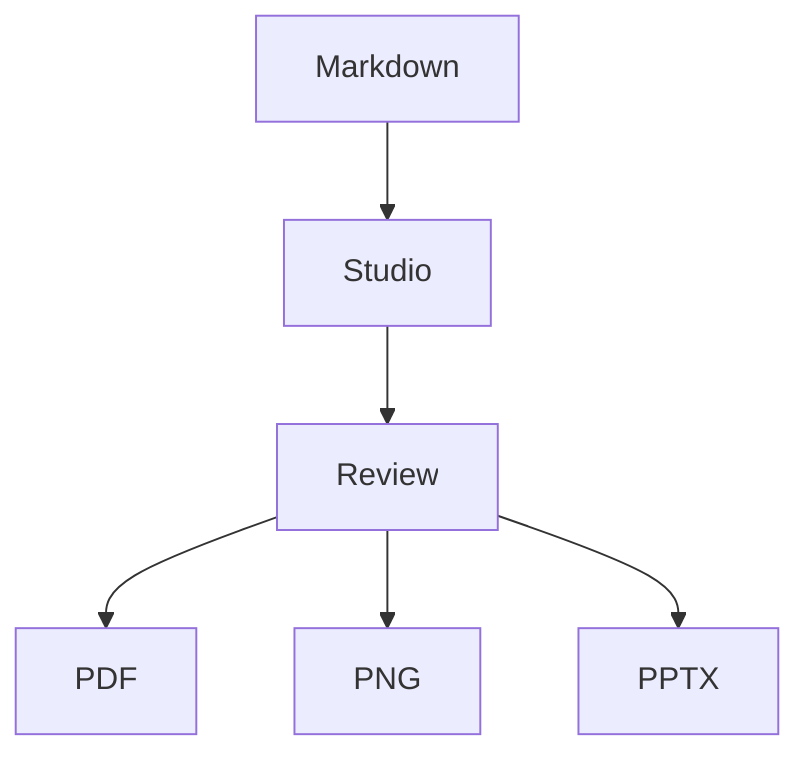

# DeckDown {{ center }}

Markdown to presentation engine, open source and local. {{ center width: 74% }}

Repo-native authoring for people and agents who want a real localhost Studio and deterministic PDF, PNG, and PPTX output. {{ center width: 80% }}

{{ cols: 3 }}

## Markdown-first

Keep the source readable, reviewable, and versioned.

{{ col: break }}

## Local Studio

Edit on localhost with live preview, docs, and workspace tools.

{{ col: break }}

## Real deliverables

Render the same deck to PDF, PNG, and PPTX without changing tools.

---

# Product-grade authoring, still made of source files

{{ cols: 2 }}

## Release proof

- Markdown editor plus local Studio preview
- Mermaid diagrams rendered in the pipeline
- LaTeX math rendered across preview and export
- Repo-native files, themes, and reusable sections
- PDF, PNG, and PPTX from the same deck

```bash
deckdown deck.md -o deck.pdf
deckdown deck.md -o slides --format png
deckdown deck.md -o deck.pptx --format pptx
```

{{ col: break }}



$$
\int_0^1 x^2 \, dx = \frac{1}{3}
$$

Warm editorial release surface, same local render path. {{ center width: 92% }}
